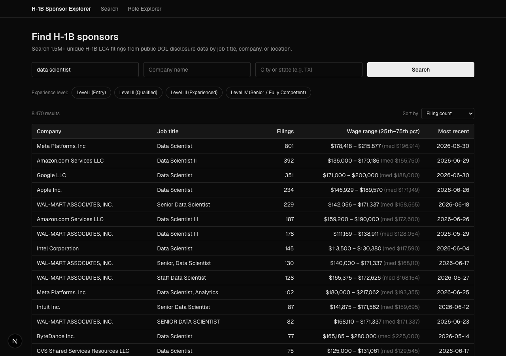
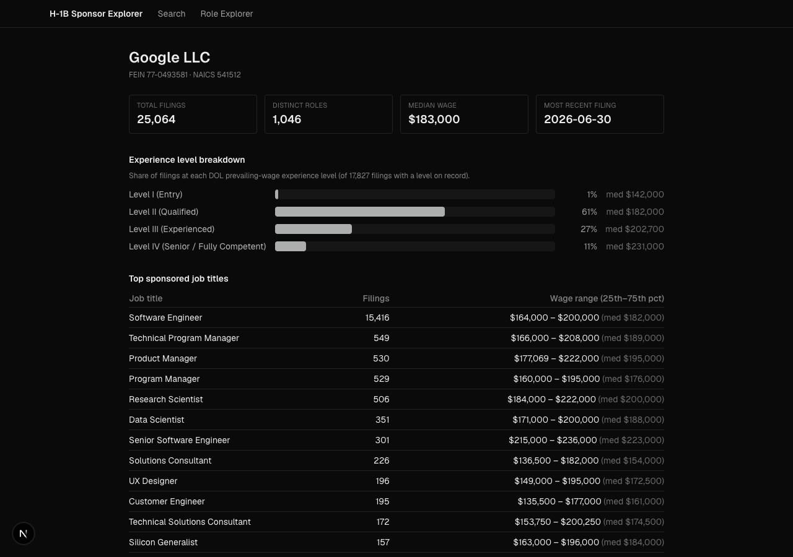
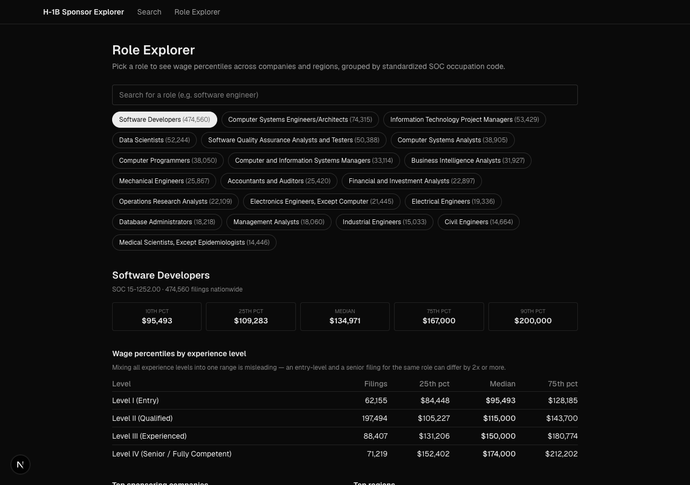

# H-1B Sponsor Explorer

**Live demo:** coming soon (deployment in progress)

Finding out which companies actually sponsor H-1B visas — and at what wage, for
which roles — means digging through the Department of Labor's raw quarterly
disclosure spreadsheets by hand. This tool does that digging for you: search
1.5M+ real H-1B filings by job title, company, or location, see a company's
sponsorship history and typical pay by seniority level, or look up wage
percentiles for a role across the whole country.



## What it does

- **Search** — job title (semantic, so "data scientist" also finds "Data
  Scientist II" and "Senior Data Scientist"), company name, worksite location,
  and experience level, all combinable and updating live as you type.
- **Company profiles** — a sponsor's total filing volume, wage ranges by role,
  an experience-level breakdown (mostly entry-level hires vs. mostly senior
  ones is a very different signal), filing volume over time, and top worksite
  locations.
- **Role explorer** — wage percentiles for a standardized occupation (SOC
  code) across companies and states, broken out by experience level so an
  entry-level and a senior filing for the "same" role aren't blended together.





## How it works

**Data source.** Everything comes from the U.S. Department of Labor's Office
of Foreign Labor Certification (OFLC) [LCA disclosure data](https://www.dol.gov/agencies/eta/foreign-labor/performance) —
the same public files any employer's H-1B Labor Condition Application filing
is drawn from. This build covers FY2024 Q1 through FY2026 Q3 (H-1B filings
only; E-3 and H-1B1 filings are filtered out at load time). DOL's quarterly
files aren't cumulative the way you'd expect — a case can reappear in a later
quarter if its status changed after the fact (e.g. certified → withdrawn) — so
the ETL keeps only the most recent record per case number, based on decision
date.

**Employer-name normalization.** The same company shows up under dozens of
spellings across filings — "Tesla, Inc." and "TESLA, INC." are both in the
raw data, for instance. Rather than fuzzy-matching names — which
risks merging two different companies that happen to have similar names — the
pipeline groups by the employer's federal tax ID (EIN), which is present on
essentially every filing and is a deterministic identifier. Fuzzy matching
(`rapidfuzz`) only kicks in as a fallback for the rare row with a missing or
placeholder EIN (DOL's raw data contains filer errors like `12-3456789` used
as a dummy value by multiple unrelated companies — the pipeline specifically
detects and excludes these instead of treating them as one shared employer).

**Local semantic search.** Job-title search uses `sentence-transformers`
(the `all-MiniLM-L6-v2` model) to embed every distinct job title once at
build time, stored in Postgres via `pgvector`. At query time, the same model
runs in-process in the Next.js API route (via `@huggingface/transformers`,
an ONNX build of the same model) to embed the search text and find the
nearest titles by cosine similarity. No external API calls, no per-request
cost — the whole search stack is a local database and a small local model.

## Setup

Requires Postgres 17+ with the `pgvector` extension, Python 3.11+, and
Node 20+.

### 1. Database

```bash
brew install postgresql@17 pgvector
brew services start postgresql@17
createdb h1b_explorer
```

### 2. Get the raw data

Download the quarterly LCA disclosure files from DOL's
[performance data page](https://www.dol.gov/agencies/eta/foreign-labor/performance)
(under "H-1B, H-1B1, E-3" → Disclosure Data). This project was built against
FY2024 Q1–Q4, FY2025 Q1–Q4, and FY2026 Q3.

### 3. Run the ETL (one-time)

```bash
cd etl
pip install -r requirements.txt
python3 load_data.py --data-dir ~/Downloads --dsn "dbname=h1b_explorer"
python3 embed_job_titles.py --dsn "dbname=h1b_explorer"
```

`load_data.py` reconciles schema drift across files, dedupes, canonicalizes
employers, and loads Postgres (~6 minutes). `embed_job_titles.py` computes
embeddings for every distinct job title and builds the vector index (~10
minutes).

### 4. Run the web app

```bash
cd web
npm install
npm run dev
```

Set `DATABASE_URL` in `web/.env.local` if it's not the default
(`postgresql:///h1b_explorer`).

## Notes on the data

- Public government data — no license restrictions, no API key, no cost.
- Percentile-based wage ranges (25th–75th, not min/max) are used everywhere
  in the UI, since a handful of rows in the raw DOL data have obvious
  data-entry errors (e.g. a wage that annualizes to hundreds of millions of
  dollars) that would otherwise distort a min/max range.
- No external API dependency anywhere — Postgres, pgvector, and a local
  embedding model are the entire stack.

## Attribution

Data: U.S. Department of Labor, Office of Foreign Labor Certification (OFLC),
[LCA Disclosure Data](https://www.dol.gov/agencies/eta/foreign-labor/performance).
Public data, not affiliated with or endorsed by DOL.
